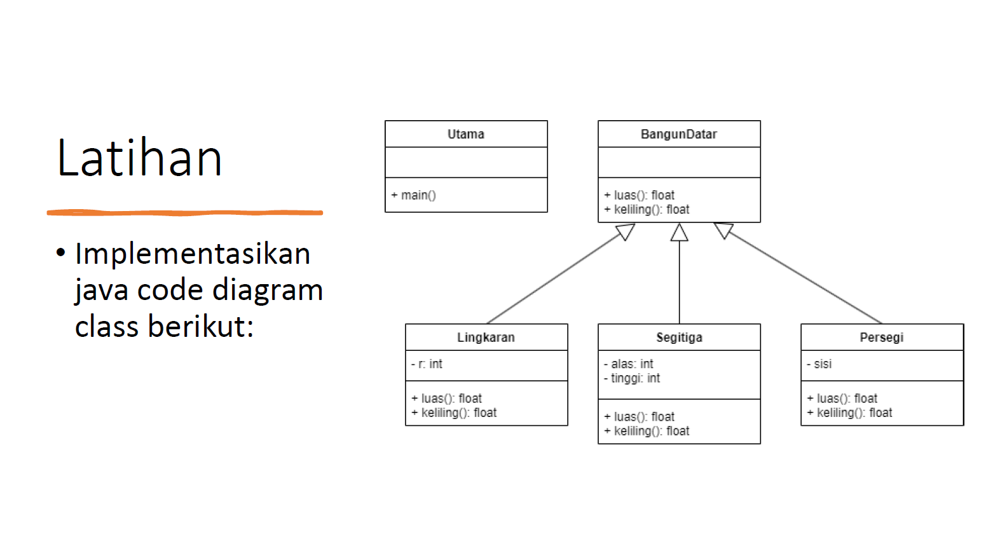
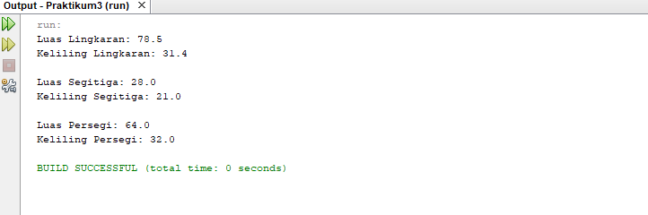

# Praktikum4

<p><b> Nama    :   Afra Nesya Apriyanthi </p>
<p><b> NIM     :   312110614 </p>
<p><b> Kelas   :   TI.21.C1 </p>
<p><b> Mata Kuliah : Pemrograman Orientasi Objek</p>
<p><b> Tugas Pertemuan 7 </p>


<p> Berikut soal dari latihan  <p>



berikut script javanya
BangunDatar.java

```java
public class BangunDatar {
    public float luas(){
        return 0;
    }
    public float keliling(){
        return 0;
    }
}
```

selanjutnya membuat java baru dengan nama Lingkaran.java

```java
public class Lingkaran extends BangunDatar{
    protected final int r = 5;

    public float luas(){
        double phi = 3.14;
        return (float) (phi * r * r);
    }

    public float keliling(){
        double phi = 3.14;
        return (float) (2 * phi * r);
    }
}
```

selanjutnya membuat java baru dengan nama Segitiga.java

```java
public class Segitiga extends BangunDatar {
    protected final int alas = 7;
    protected final int tinggi = 8;

    public float luas(){
        return (float) (0.5 * this.alas * this.tinggi);
    }

    public float keliling(){
        return (float) (3 * this.alas);
    }
}
```

selanjutnya membuat java baru dengan nama Persegi.java

```java
public class Persegi extends BangunDatar {
    private final double sisi = 8;

    public float luas(){
        return (float) (this.sisi * this.sisi);
    }

    public float keliling(){
        return (float) (4 * this.sisi);
    }
}
```


dan terakhir membuat java baru dengan nama Main.java
```java
public class Main {
    public static void main(String[] args) {
        Lingkaran lingkaran = new Lingkaran();
        Segitiga segitiga = new Segitiga();
        Persegi persegi = new Persegi();

        // Lingkaran
        System.out.println("Luas Lingkaran: " + lingkaran.luas());
        System.out.println("Keliling Lingkaran: " + lingkaran.keliling() + "\n");

        // Segitiga
        System.out.println("Luas Segitiga: " + segitiga.luas());
        System.out.println("Keliling Segitiga: " + segitiga.keliling() + "\n");

        // Persegi
        System.out.println("Luas Persegi: " + persegi.luas());
        System.out.println("Keliling Persegi: " + persegi.keliling() + "\n");
    }
}
```

<p> Maka hasil outputnya adalah<p>



